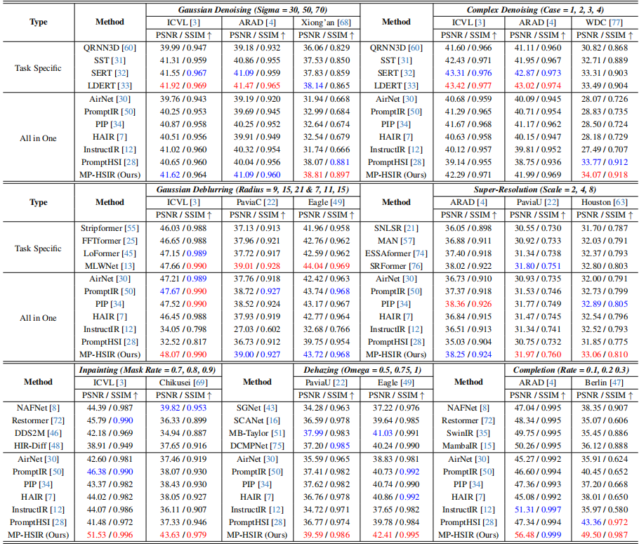
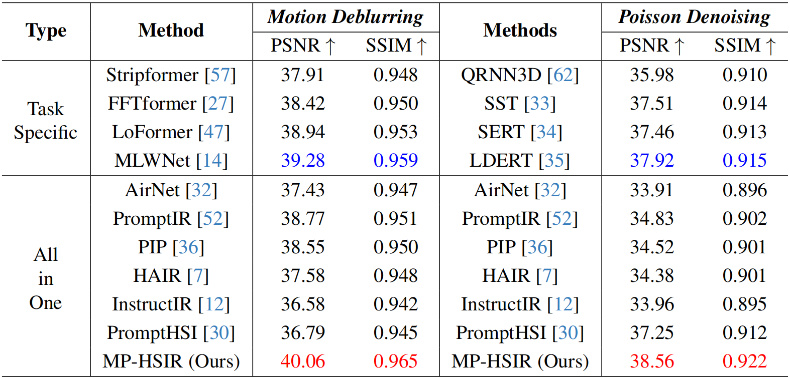

# MP-HSIR: A Multi-Prompt Framework for Universal Hyperspectral Image Restoration (offical)

Zhehui Wu, [Yong Chen](https://chenyong1993.github.io/yongchen.github.io/), [Naoto Yokoya](https://naotoyokoya.com/), [Wei He](https://prowdiy.github.io/weihe.github.io/)

[[Paper(arxiv)]](https://arxiv.org/abs/2503.09131) 

> ## **Abstract**
> Hyperspectral images (HSIs) often suffer from diverse and unknown degradations during imaging, leading to severe spectral and spatial distortions. Existing HSI restoration methods typically rely on specific degradation assumptions, limiting their effectiveness in complex scenarios. In this paper, we propose **MP-HSIR**, a novel multi-prompt framework that effectively integrates **spectral, textual, and visual prompts** to achieve universal HSI restoration across diverse degradation types and intensities. Specifically, we develop a **prompt-guided spatial-spectral transformer**, which incorporates **spatial self-attention** and a **prompt-guided dual-branch spectral self-attention**. Since degradations affect spectral features differently, we introduce **spectral prompts** in the local spectral branch to provide **universal low-rank spectral patterns** as prior knowledge for enhancing spectral reconstruction. Furthermore, the **text-visual synergistic prompt** fuses high-level semantic representations with fine-grained visual features to encode degradation information, thereby guiding the restoration process. Extensive experiments on **9 HSI restoration tasks**, including all-in-one scenarios, generalization tests, and real-world cases, demonstrate that **MP-HSIR** not only consistently outperforms existing all-in-one methods but also surpasses state-of-the-art task-specific approaches across multiple tasks.

## **Network Architecture**


## **Schedule**
✅ 1：Public pre-trained models and main codes.  
❌ 2：More complete code, checkpoints for comparison methods, project page, etc. (Coming soon)  

## **Installation and Data Preparation**

```
git clone https://github.com/ZhehuiWu/MP-HSIR.git
cd MP-HSIR
pip install -r requirements.txt
```

The download paths and partitioning methods for the dataset can be found in the `data_dir/`, and all test datasets are available for download from the [test_dataset](https://drive.google.com/drive/folders/1S-f6mI18bmR7wlsts67lk0-6Oyx5_gIs?usp=drive_link).


## **Models**

Pre-trained models for natural scenes and remote sensing can be downloaded from [ckpt](https://drive.google.com/drive/folders/1J4OA_gUiZHGvYNvXDiaFwIvz8vC5D6xB?usp=drive_link).


## **Training and Testing**
### **Training**
After processing the data according to the instructions in `data_dir/`, you can train the natural scene and remote sensing models respectively according to the following code:

```
# For Natural Scene
python train.py --epochs 100 --lr 2e-4 --data_type natural_scene --db_path /data/Train/Natural_scene_minmax_patch_64.db
# For Remote Sensing
python train.py --epochs 300 --lr 1e-4 --data_type remote_sensing --db_path /data/Train/Remote_sensing_minmax_patch_64.db
```


### **Testing**
Here are some examples of tests for degenerate tasks:

```
# Gaussian Denoise
python test.py --mode 0 --test_dir /data/Test/ICVL --ckpt_path /MP-HSIR-main/ckpt/Natural_scene.ckpt
# Complex Denoise
python test.py --mode 4 --test_dir /data/Test/ARAD --ckpt_path /MP-HSIR-main/ckpt/Natural_scene.ckpt
# Inpaint
python test.py --mode 8 --test_dir /data/Test/Chikusei --ckpt_path /MP-HSIR-main/ckpt/Remote_sensing.ckpt
# Dehaze
python test.py --mode 9 --test_dir /data/Test/Eagle --ckpt_path /MP-HSIR-main/ckpt/Remote_sensing.ckpt
```

## **Results**
<details>
  <summary>PSNR comparison across 9 tasks. (click to expand)</summary>
  
</details>

<details>
  <summary>Quantitative comparison of the all-in-one setting. (click to expand)</summary>
  
</details>

<details>
  <summary>Quantitative comparison of the generalization setting. (click to expand)</summary>
  
</details>

<details>
  <summary>Visualization results of the all-in-one setting. (click to expand)</summary>
  
</details>

<details>
  <summary>Visualization results of the real-world scenarios. (click to expand)</summary>
  
</details>

## **Citations**
If you find the code helpful in your resarch or work, please cite the following paper(s).
```
@misc{wu2025mphsirmultipromptframeworkuniversal,
      title={MP-HSIR: A Multi-Prompt Framework for Universal Hyperspectral Image Restoration}, 
      author={Zhehui Wu and Yong Chen and Naoto Yokoya and Wei He},
      year={2025},
      eprint={2503.09131},
      archivePrefix={arXiv},
      primaryClass={cs.CV},
      url={https://arxiv.org/abs/2503.09131}, 
}
```